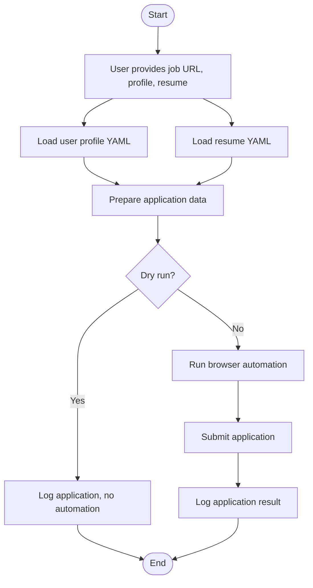

# Agentic Jobber: Diagrams & Project Status

---

## 1. High-Level Architecture

```mermaid
flowchart TD
    A[User CLI/Script] -->|YAML paths, job URL| B[Integration Module]
    B --> C[User Profile Model]
    B --> D[Resume Model]
    B --> E[Job Application Log Model]
    B --> F[Browser Automation (Playwright)]
    F -.->|Future| G[LLM/AI Assistance]
    E --> H[Log File (YAML)]
    C -->|Loads| I[User Profile YAML]
    D -->|Loads| J[Resume YAML]
```

---

## 2. Data Flowchart

```mermaid
flowchart TD
    A[User provides job URL, profile & resume YAML]
    B[Integration loads user profile]
    C[Integration loads resume]
    D[Integration prepares job application]
    E[Browser automation (Playwright)]
    F[Application submitted]
    G[Log application in YAML]
    
    A --> B
    A --> C
    B & C --> D
    D --> E
    E --> F
    F --> G
```

---

## 3. Workflow Flowchart



---

## 4. Project Status Checklist

### Core Data Models
- [x] User Profile Model
- [x] Resume Model
- [x] Job Application Log Model

### Integration & Automation
- [x] Integration script (loads models, CLI, logging)
- [ ] File I/O for user info and resume (robust error handling)
- [ ] Configuration management for credentials (env vars, secure storage)
- [ ] Full integration: connect all models in a single workflow (in progress)
- [ ] Browser automation: job form filling and submission (only Playwright test exists)
- [ ] Error handling and logging throughout
- [ ] (Optional) CLI/script interface for user-triggered workflow (basic version exists, needs polish)

---

*Update diagrams and checklist as the project evolves.* 

## **Low-Level System Diagram (MVP: Config-Driven Automation)**

```
+-------------------+      +-------------------+      +-------------------+      +-------------------+
|  User Input (CLI) | ---> |  Load Config JSON | ---> |  Browser Automation| ---> |   Log Results     |
+-------------------+      +-------------------+      +-------------------+      +-------------------+
        |                        |                          |                          |
        |                        |                          |                          |
        v                        v                          v                          v
  (job link, resume,      (site-specific selectors)   (fill form fields,         (success/failure,
   name, email)                                      upload resume, submit)      errors, timestamp)
```

## **Step-by-Step Execution Plan**

### 1. **User Input (CLI)**
- User provides:
  - Job site link (e.g., LinkedIn job posting)
  - Resume file path
  - Name and email (or loads from profile YAML)
- CLI parses and validates these inputs.

### 2. **Load Config JSON**
- System detects which site the job link belongs to (e.g., LinkedIn, Indeed, Instahyre).
- Loads the corresponding JSON config file, which contains:
  - CSS/XPath selectors for: name, email, resume upload, job title search, submit button.
  - Any site-specific quirks (e.g., wait times, extra clicks).

**Technical Concept:**  
- **Selector:** A string (CSS or XPath) that uniquely identifies an element on a web page.  
  - Example: `input[name="email"]` or `//input[@type="file"]`

### 3. **Browser Automation (Playwright)**
- Launches a browser (headless or visible, for debugging).
- Navigates to the job link.
- Uses selectors from the config to:
  - Fill in the name and email fields.
  - Upload the resume file.
  - (If required) Enter job title in a search field.
  - Click the submit button.
- Waits for confirmation or error message.

**Technical Concepts:**  
- **Playwright:** A Python library for browser automation. It can control Chrome, Firefox, etc., and interact with web pages like a human.
- **Headless Mode:** Running the browser without a GUI, useful for automation and speed.

### 4. **Error Handling and Logging**
- If a selector is not found or an action fails:
  - Log the error (with context: which field, which site, what failed).
  - Continue to the next field or step.
- After submission, log:
  - Success/failure
  - Any error messages
  - Timestamp
  - Job link and user info used

**Technical Concept:**  
- **Logging:** Writing structured information about events/errors to a file for later review and debugging.

## **Example Config JSON (for LinkedIn)**
```json
{
  "site": "linkedin.com",
  "fields": {
    "name": "input[name='fullName']",
    "email": "input[name='email']",
    "resume_upload": "input[type='file']",
    "job_title_search": "input[placeholder='Search jobs']",
    "submit_button": "button[type='submit']"
  }
}
```
*Each site will have its own config file with selectors tailored to its DOM structure.*

## **Iterative Error Handling**
- All errors are logged (not fatal).
- The system continues to try filling/submitting the form even if some fields fail.
- Logs are reviewed after each run to improve selectors/configs and add robustness.

## **Summary Table of Key Concepts**

| Concept         | What It Means (for Data Scientists)                                  |
|-----------------|---------------------------------------------------------------------|
| Selector        | A way to programmatically find a field/button on a web page         |
| Playwright      | Python tool to automate browsers, like Selenium but newer/faster    |
| Headless Mode   | Browser runs in the background, no window pops up                   |
| Logging         | Recording what happened, especially errors, for debugging           |
| Config JSON     | A file that tells the bot where to find and how to fill each field  |

## **Next Steps**
1. Draft the JSON config files for LinkedIn, Indeed, and Instahyre (minimum fields).
2. Scaffold the Python modules for:
   - CLI input
   - Config loader
   - Playwright automation
   - Logging
3. Review and refine the plan before implementation.

**Would you like to see a sample config for all three sites, or a more detailed flowchart before we start coding?** 